# Ainex_Kakip
## 1. Overview  

The Renesas RZV2H chip on the Kakip board powers this entire demo. It consists of a main arm A55 processor with an AI accelerator called DRPAI which is utilized in this demo. The AINEX robot is controlled using the A55 core thorough its GPIO pins using the UART protocol. A camera input is taken frame by frame and is processed on the DRPAI accelerator using a yoloc3 detector for detecting the hand gestures. Based on the gesture detected, the corresponding action is executed from the A55 core to the motor controller. 

## 2. Architectural Diagram 


## 3. Hardware Setup
1. Begin by setting up the Robot as required.


2. Remove Raspberry pi  
 
3. Solder pullup resistor on Kakip board as shown in figure for resolving the issue while working with DRPAI. Solder pullup resistor on Kakip board as shown in figure for resolving the issue while working with DRPAI

    

    

4. Set the DIP switch as follows 

    

5. Connect the debugger cable. 

    

6. Attach the Kakip on AINEX robot.
    
    

7. Detach the camera head from AINEX and attach Logi C90 for better resolution.
    
    AINEX Camera: 

     

    
    Logi Camera : 

    

8. Power up using the provided battery

    The battery used is shown in figure

    


## 4.Getting started with Kakip board

### 4.1 Preparing SD Card: 
1.  Format the SD card using Gparted. 

    ```bash
    sudo apt-get install gparted
    ```

    Select the USB device memory card

    Delete all partitions and make a single one

    (unmount followed by right click → delete)
2. Use Fat32 as file system

    right click → new → File system should be fat32 → Add

    


3. Click on tick mark for apply all operation → Apply


### 4.2 Flashing Image on SD Card.

There are 2 methods:
1. Downloading the Image file given which have the demo inbuilt in it, flash it and run it following the steps below:
    i.   Download the given image file of sd card - [Handgesture_out.img.xz](https://ignitariumtech-my.sharepoint.com/:f:/g/personal/irine_jose_ignitarium_com/ErmMOJcEKytBkvrMynI04mEBw6d_aa1i4WUL-xO-m1kSFg?e=SZc5Vk)
    
    ii.  Unzip the image

    ```bash
    xz -d out.img.xz
    ```
    
    iii. Write the downloaded Image to a device
    ```bash
    sudo dd if=out.img of=/dev/sdX bs=4M status=progress
    ```

    ```
    if=out.img: Input file
    of=/dev/sdX: Output device (replace sdX with your actual device name)
    bs=4M: Block size
    status=progress: Show progress
    ```
    
    iv. Now unmount the SD card from PC and mount it in Kakip board. 
    
    v.  Follow the steps in Section [5.3 Running the application](#53-running-the-application), for running the application

2. Else to develope from scratch, follow the steps to start with flashing the Ubuntu 24.04 Image on the SD card,

    i.  Download the ubuntu image from the following link, 

        https://amatama-my.sharepoint.com/:f:/g/personal/yuichi_horiuchi_amatama_onmicrosoft_com/ElrlDdJrIFBJsiOFYSBqh-4B9v1bY4-kuGneQeIGQxSdCw?e=7mWfvf 

    ii. Flash the ubuntu image into SD Card from the following link using Balena etcher or using Ubuntu writer as shown below : 

    


### 4.3 Update the Linux Kernel

Steps for setting up, applying patches, running the application, and building it, 

#### 4.3.1. Build Environment (Same for application building) 

Create a container image of the AI SDK for RZ/V2H refering [Renesas procedure](https://renesas-rz.github.io/rzv_ai_sdk/5.00/getting_started.html).

Follow the below steps for creating container image:

##### 4.3.1.a Pre-requistes

1. Install Docker 

##### 4..3.1.b Setting up build environment for Kakip Kernel Development
1. Download AI SDK from the [link](https://www.renesas.com/document/sws/rzv2h-ai-sdk-v500)

     Extract RZ/V AI SDK package
2. On your Linux PC, make the working directory.
```bash
mkdir -p ai_sdk_work
```
3. Register the working directory path to an environment variable.
```bash
export WORK=<path to the working directory>/ai_sdk_work
```
4. Move to the working directory.
```bash
cd ${WORK}
```
5. Extract RZ/V AI SDK zip file under the working directory.
```bash
unzip <Path to the file>/RTK0EF0*.zip -d ${WORK}
```
6. Check the working directory to confirm the package contents.
```bash
ls ${WORK}/
```
- If the above command prints followings, the package is extracted correctly.
    ```bash
    ai_sdk_setup  board_setup  documents  references r11an0*.pdf
    ```
7. On your Linux PC, move to the working directory.
```bash
cd ${WORK}/ai_sdk_setup
```

8. Docker build
```bash
docker build -t rzv2h_ai_sdk_image --build-arg SDK="/opt/poky/3.1.31" --build-arg PRODUCT="V2H" .
```

9. Create new directory to be mounted on Docker container.
```bash
mkdir ${WORK}/ai_sdk_setup/data
```

10. Create docker container
```bash
sudo docker run --name kakip_env -it -v $PWD:/kakip_linux -w /kakip_linux rzv2h_ai_sdk_image
```


#### 4.3.2 Build Instructions


1. In new terminal list docker

```bash
sudo docker ps -a
```
start docker
```bash
sudo docker start -i kakip_env
```
If using for first time, nano may not be installed in docker, so install nano first to edit the files: 

```bash
apt update
apt install nano
```

if you want to delete the folder 
```bash
sudo docker exec -ti 00020d9a098b rm -rf /home/kakip_linux 
```
 
Clone the kakip_linux repository   
```bash
cd home
git clone https://github.com/Kakip-ai/kakip_linux
cd kakip_linux
```

2. Configuring the Kernel Config
```bash
cp ./arch/arm64/configs/kakip.config .config
```


3. Setting Environment Variables and Installing Dependencies

```bash
source /opt/poky/3.1.31/environment-setup-aarch64-poky-linux
apt update && apt install -y flex bison bc
```

4. Edit the dts file from the following path 

```bash
cd arch/arm64/boot/dts/renesas
#for pin address

nano kakip-es1.dts #edit in this file
```

In line number 231 & 232, do the following edits 

```
#for address mapping copy the first .dtsi and paste it in the terminal with nano.
#sci4_pins: sci4 {
#        pinmux = <RZG2L_PORT_PINMUX(7, 2, 1)>, /* SCI4_TXD_MOSI_SDA */
#                 <RZG2L_PORT_PINMUX(7, 3, 1)>; /* SCI4_RXD_MISO_SCL */
#};
```

```bash
source /opt/poky/3.1.31/environment-setup-aarch64-poky-linux
apt update && apt install -y flex bison bc
```


5. Build

Go back to kakip_linux folder
```bash
cd /home/kakip_linux 

make -j4 Image
make -j4 renesas/kakip-es1.dtb
```

The build artifacts are the following two points.
```bash
./arch/arm64/boot/Image
./arch/arm64/boot/dts/renesas/kakip-es1.dtb
```

After building, exit from the container with exit.

```bash
exit
```

Copy the files into the sd card mounted with ubuntu images

1. First will delete the existing image: 

```bash
cd <folder_path> 

sudo rm -rf  kakip-es1.dtb Image-5.10.145-cip17-yocto-standard 
```


2. Copy the files  

```bash
sudo docker cp kakip_env:/root/kakip_linux/arch/arm64/boot/dts/renesas/kakip-es1.dtb /media/irinj/root/boot/
```

```bash
sudo docker cp kakip_env:/kakip_linux/kakip_linux/arch/arm64/boot/dts/renesas/r9a09g057.dtsi /media/irinj/root/boot
```


#### 4.3.4. For the first bootup of Kakip via serial/ssh  

1. Connect the ethernet 

2. Boot up the Kakip. 

3. Open gtkterm using 

    ```bash
    sudo gtkterm 
    ``` 

4. In the configuration -> port, select the serial port and set the baud rate (debugger) into 115200 

5. Login using the user ID(ubuntu) and password 

 6. Check for the ip address using the command in the serial terminal -  

    ```bash
    ifconfig  
    ```

7. Open new terminal and ssh into the board using the following command 

    ```bash
    ssh ubuntu@<ip_address>  
    ```
 

8. Change locale:
    Change the locale in the following path:
    ```bash
    nano /etc/default/locale

    #in the opening window
    LANG=en_US.UTF-8
    LANGUAGE=en_US:en
    ```
    
    ```bash
    sudo dpkg-reconfigure locales
    #press enter twice and 97 followed by 3.

    #close it and 
    reboot now
    ```


 
## 5. Hand gesture recognition demo in Kakip Board 

This application showcases the capability of deep neural networks to predict different hand gestures. It detects total of 8 Gestures that includes one, two, three, four, five, thumbs up, thumbs down and rock in the hand with the highest precision.  

### 5.1 Docker environment for compiling the application  

#### Step 1: Clone the Repository in Linux PC 

After setting up the docker, go to the working repository and clone the repositories below in the docker 

```bash
cd /home/kakip_linux  

export WORK=/home/kakip_linux/ 

cd ${WORK} 

git clone https://github.com/Ignitarium-Renesas/Kakip_Humanoid.git
```

Note: 

In future, to edit the port or socket address file, follow the below steps for:  

1. For changing the port and IP address in hand_gesture_recognition.cpp 

```bash
cd ${WORK}/Kakip_Humanoid/Hand_gesture/Gesture_Recognition/src 

nano hand_gesture_recognition.cpp 
```
 

change line no: 55, with the correct PORT address 

```
/* DRP-AI TVM[*1] Runtime object */ 

MeraDrpRuntimeWrapper runtime; 

#define PORT 9091 

int sock = 0; 
```

change ip address in line no: 964, with the correct PORT address 
```
if (inet_pton(AF_INET, "127.0.0.1", &serv_addr.sin_addr) <= 0) { 

printf("\nInvalid address/ Address not supported \n"); 

return -1; 

} 
```
 

2. Similarly, the same Port and IP address should be used in socket_gesture.py 
```
${WORK}/Kakip_Humanoid/Hand_gesture/A55_GPIO 

nano socket_gesture.py 
```
change in line no: 4 
```
def start_server(host='127.0.0.1', port=9091): 
```
#### Step 2: Build the Application 

Build the application by following the commands below. 

```bash
mkdir -p build && cd build 

cmake -DCMAKE_TOOLCHAIN_FILE=./toolchain/runtime.cmake -DV2H=ON .. 

make -j$(nproc) 
```

#### Step 3: Locate the Generated Application 

The built application file will be available in the following directory: 

```bash
${WORK}/Kakip_Humanoid/Hand_gesture/Gesture_Recognition/src/build  
```

The generated file will be named: 

```bash
hand_gesture_recognition_v2_app 
```

#### Step 4: Application: Deploy Stage 

Follow the steps below to deploy the project on board.  

Run the commands below to download deploy_tvm-v230.so from Release v5.00 

```bash
cd ${WORK}/Kakip_Humanoid/Hand_gesture/Gesture_Recognition/exe_v2h/hand_yolov3_onnx  
```

```bash
wget https://github.com/Ignitarium-Renesas/rzv_ai_apps/releases/download/v5.00/12_Hand_gesture_recognition_v2_deploy_tvm-v230.so 
```

Rename the Hand_gesture_recognition_v2_deploy_tvm-v230.so to deploy.so. 

```bash
mv Hand_gesture_recognition_v2_deploy_tvm-v230.so deploy.so 
```

Follow the steps in session [Running the application](#running-the-application) 

### 5.2 Copy the binary file and source code to Kakip 

Copy the source code into kaki board 

In your Linux PC: 
```
sudo scp -r ${WORK}/Kakip_Humanoid ubuntu@<ip>:/home/ubuntu/ 
```
### 5.3 Running the application

#### 5.3.1 Prerequisite to run the application in Kakip 

Follow the below commands before running the application in kakip 

```bash
ssh ubuntu@<IP> 

sudo apt update  

sudo apt install libpcre3  

sudo ldconfig  

ldconfig -p | grep libpcre  

sudo ln -s /usr/lib/aarch64-linux-gnu/libpcre.so.3 /usr/lib/aarch64-linux-gnu/libpcre.so.1 
```

To execute the application using CR8 follow section : [Execution using CR8](#6-enabling-cr8-through-uboot)

#### 5.3.2. Executing the application using A55

Follow the commands below for running the application. 

##### Step 1: Copy the lib_tvm file 
```bash
cd /home/ubuntu/Kakip_Humanoid/libtvm_runtime.so /usr/lib64 
```
##### Step 2: Run the motor control code for Humanoid Robot 

```bash
cd Hand_gesture/A55_GPIO 

python3 socket_gesture.py 
```

##### Step 3: Run Hand gesture demo code 

```bash
cd Hand_gesture/Hand_Gesture_Recognition/exe_v2h 
./hand_gesture USB 
```

#### Output Frame:


### 6. Enabling cr8 through uboot

Keep the Kakip's DIP switches as below: 

```
1 & 2 - ON 

3 & 4 - OFF 
```

Follow the below steps for enabling cr8 through uboot:

1. Install E2studio as per the section [e2 studio installation](#e2-studio-setup)
2. Load the e2 studio project file and build all
3. Copy and paste the following bin files inside the debug folder into root/boot of sd card
```bash
sudo cp rzv2h_cr8_rpmsg_demo_sdram.bin /media/<usr>/root/boot
sudo cp rzv2h_cr8_rpmsg_demo_itcm.bin /media/<usr>/root/boot
sudo cp rzv2h_cr8_rpmsg_demo_sram.bin /media/<usr>/root/boot
```
4. Reboot kakipi and log on to uboot
```
Press any key when asked to stop auto boot
```
5. Starting the CR8 program
```bash
=> setenv cr8start 'dcache off; mw.l 0x10420D24 0x04000000; mw.l 0x10420600 0xE000E000; mw.l 0x10420604 0x00030003; mw.l 0x10420908 0x1FFF0000; mw.l 0x10420C44 0x003F0000; mw.l 0x10420C14 0x00000000; mw.l 0x10420908 0x10001000; mw.l 0x10420C48 0x00000020; mw.l 0x10420908 0x1FFF1FFF; mw.l 0x10420C48 0x00000000; ext4load mmc 0:2 0x12040000 boot/rzv2h_cr8_rpmsg_demo_itcm.bin; ext4load mmc 0:2 0x08180000 boot/rzv2h_cr8_rpmsg_demo_sram.bin; ext4load mmc 0:2 0x40800000 boot/rzv2h_cr8_rpmsg_demo_sdram.bin; mw.l 0x10420C14 0x00000003; dcache on;'

=> saveenv

=> run cr8start
``` 

After starting the CR8 program, boot into Linux.

```bash
=> run bootcmd
```

6. Run the motor control code for Humanoid Robot 

run scoket server with rp msg 
```bash
sudo ./rpmsg_sample_client  
```

7. Run Hand gesture demo code 
```bash
cd Hand_gesture/Gesture_Recognition/exe_v2h 
./hand_gesture_kakip USB 
``` 


### 7. E2 studio Setup 

Download the software from the below link Development environment setup  

```
Note: 

For windows: setup_e2_studio_2024-01_1.exe 
For Linux: e2studio_installer-2024-01_1.Linux_host.run 
```

#### Step 1 

change the Install Location and specify where to install e2studio. 

 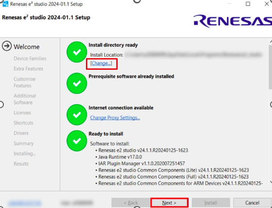

#### Step 2 

select GNU ARM Embedded 12.2-Rel1. 

  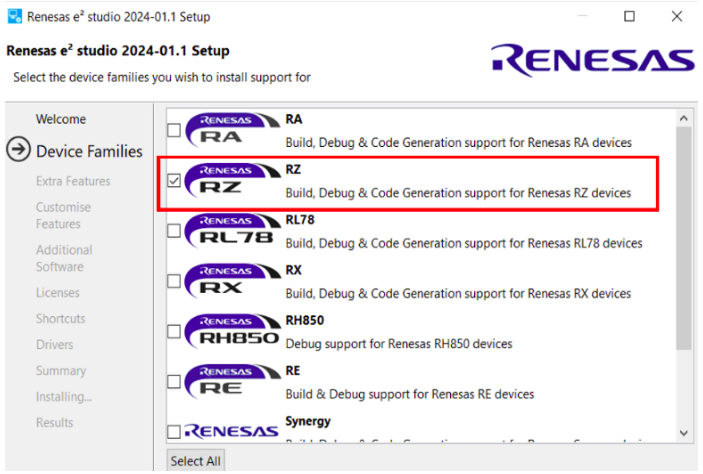

#### Step 3 

select FSP. 

  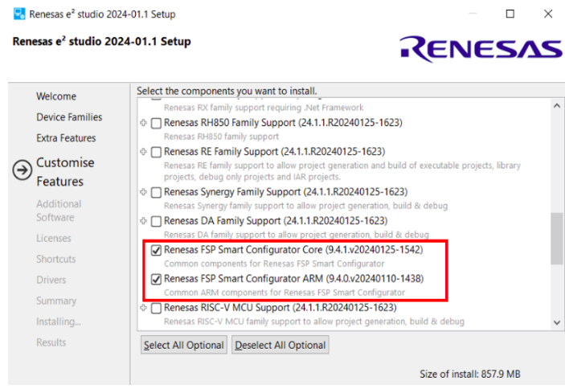

##@# Step 4 

select GNU ARM Embedded 12.2-Rel1 

  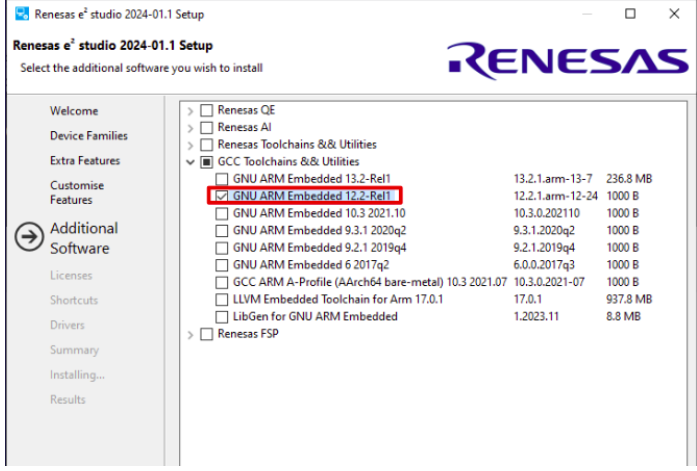

#### Step 5 

select GNU ARM Embedded 12.2-Rel1 

 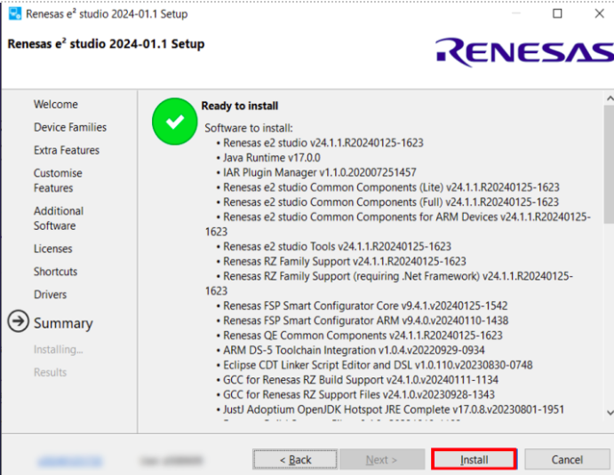
 

#### Step 6 

Download the FSP Package from the below link or from assets [RZ_FSP](https://ignitariumtech-my.sharepoint.com/personal/benson_k_ignitarium_com/_layouts/15/onedrive.aspx?id=%2Fpersonal%2Fbenson%5Fk%5Fignitarium%5Fcom%2FDocuments%2FGit%20hub%20Don%27t%20delete%2FAinex%2Fasset%2FE2studio%5Finstaller%2FRZV%5FFSP%5FPacks%5Fv2%2E0%2E0%2Drc%2E0%2B20240321%2Efd15d6da%2Ezip&parent=%2Fpersonal%2Fbenson%5Fk%5Fignitarium%5Fcom%2FDocuments%2FGit%20hub%20Don%27t%20delete%2FAinex%2Fasset%2FE2studio%5Finstaller&ga=1)

 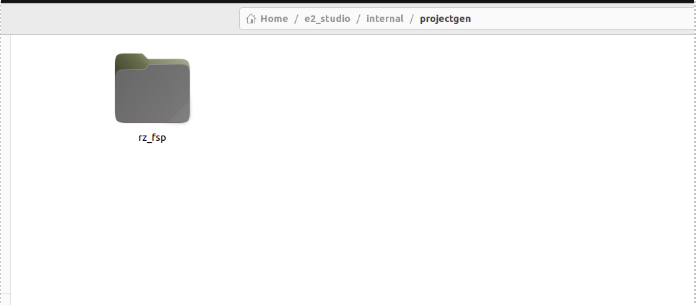 

After installation copy rz_fsp folder into the projectgen location which is located in E2 studio installation folder 

#### Step 7 

click Help > CMSIS Packs Management > Renesas RZ/V If FSP Packs is successfully installed it will shows here 

  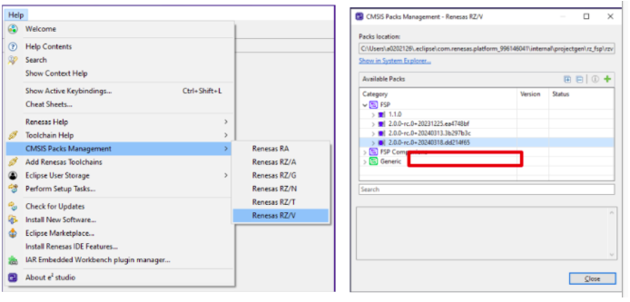

#### Step 8 

Download the zip file and Load into e2 studio [zv2h_cm33_rpmsg_demo and rzv2h_cr8_rpmsg_demo](https://ignitariumtech-my.sharepoint.com/personal/benson_k_ignitarium_com/_layouts/15/onedrive.aspx?id=%2Fpersonal%2Fbenson%5Fk%5Fignitarium%5Fcom%2FDocuments%2FGit%20hub%20Don%27t%20delete%2FAinex%2Fasset%2FE2studio%5Finstaller%2Frzv2h%5Fdemo%5Fe2%5Fstudio%5Ffiles%2Ezip&parent=%2Fpersonal%2Fbenson%5Fk%5Fignitarium%5Fcom%2FDocuments%2FGit%20hub%20Don%27t%20delete%2FAinex%2Fasset%2FE2studio%5Finstaller&ga=1)

 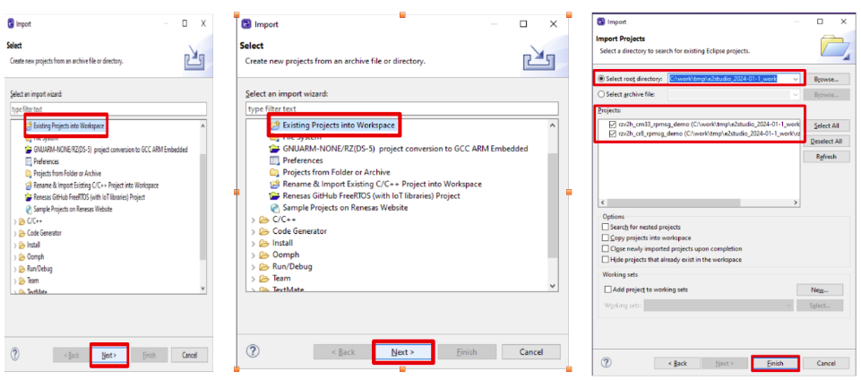


click Project > Build All 

#### Step 9 

Installation of [J-link Software](https://www.segger.com/downloads/jlink/)

 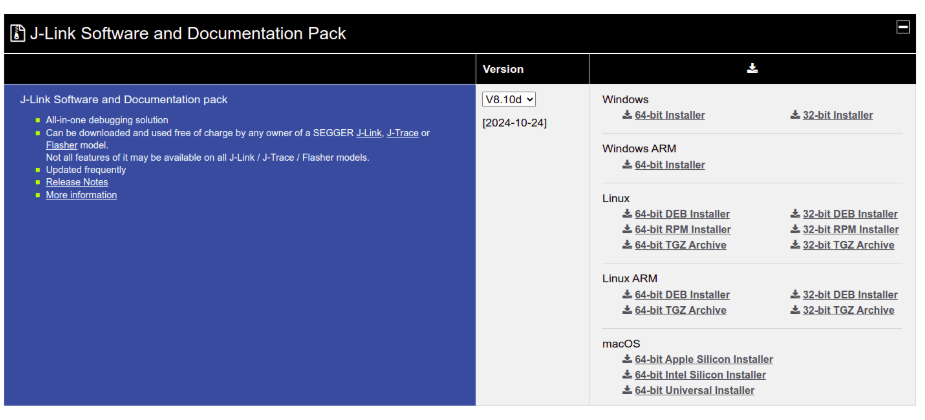
 
download and install the software 

#### Step 10 

Installation of Python 3.10 

```bash
sudo apt update 
sudo apt install python3.10 
sudo add-apt-repository ppa:deadsnakes/ppa 
sudo apt update 
sudo apt install python3.10 
python3.10 --version  
```

#### Step 11 

turn on the RZV2H 

  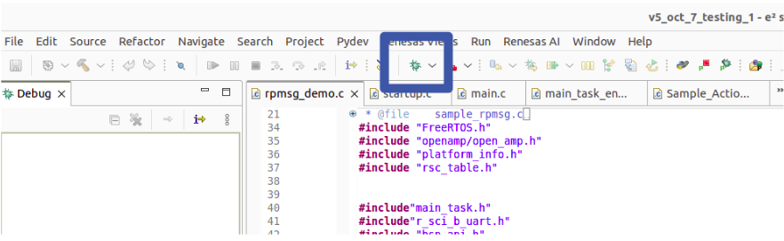

flash the code with button 

#### Step 12 

run the code with Resume button 

 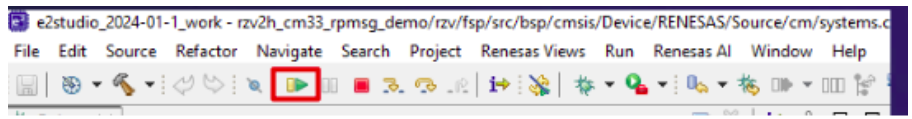

## Reference 

Kakip Hardware: https://www.kakip.ai/wp-content/uploads/2024/04/Kakip_HW_Ref.pdf 

https://yds-kakip-team.github.io/techdoc/jp/ 

 