# Ainex_Kakip
## 1. Architectural Diagram 
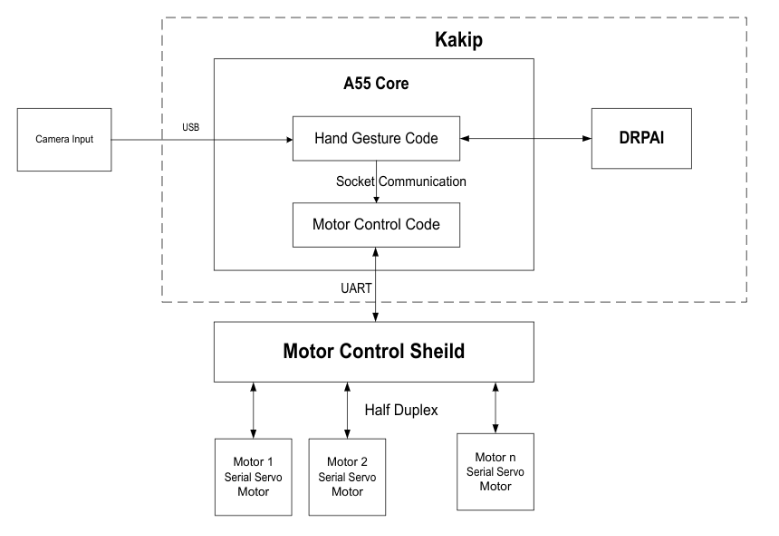


## 2. Hardware Setup
1. Begin by setting up the Robot as required.

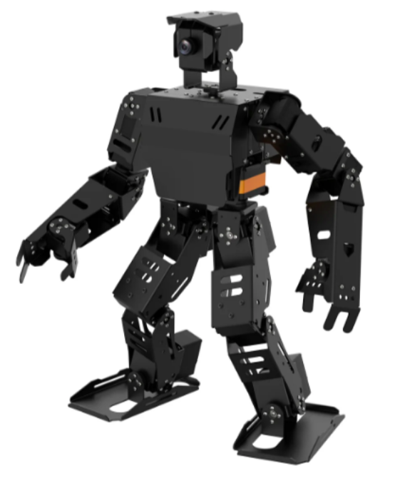

2. Remove Raspberry pi  
 
3. Solder pullup resistor on Kakip board as shown in figure for resolving the issue while working with DRPAI. Solder pullup resistor on Kakip board as shown in figure for resolving the issue while working with DRPAI

    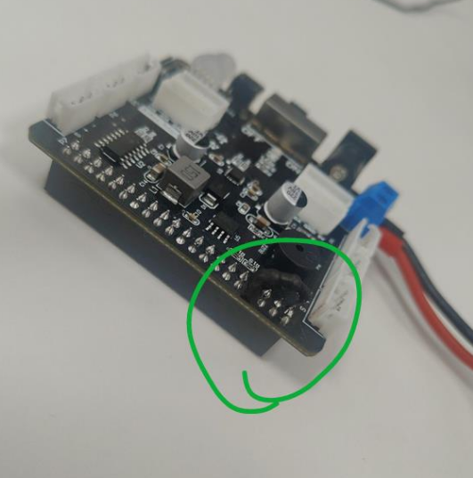

    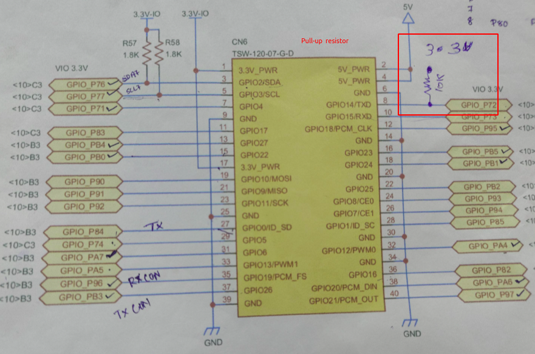

4. Set the DIP switch as follows 

    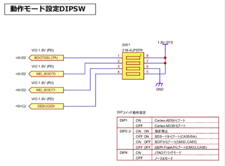

5. Connect the debugger cable. 

    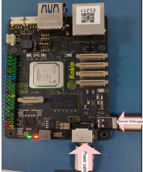

6. Attach the Kakip on AINEX robot.
    
    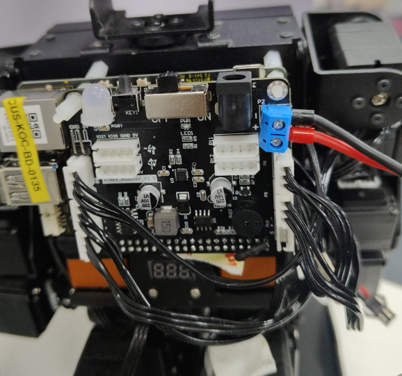

7. Detach the camera head from AINEX and attach Logi C90 for better resolution.
    
    AINEX Camera: 

    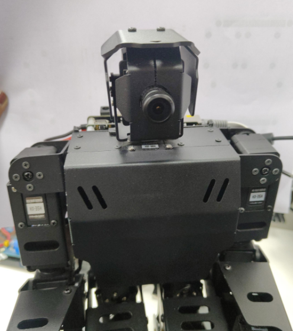 

    
    Logi Camera : 

    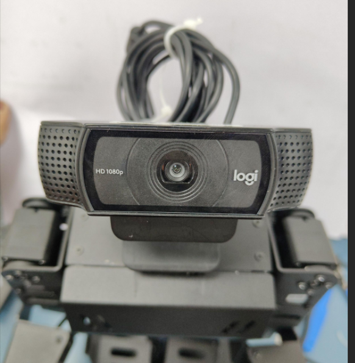

8. Power up using the provided battery

    The battery used is shown in figure

    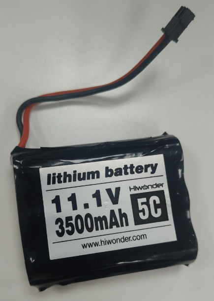


## 3.Getting started with Kakip board
To get started move into the required path to clone the repositary from the following link:

https://gitlab.ignitarium.in/ign-ai/customer/renesas/AiNex_Humanoid/Ainex_Kakip

Commands :

```bash
git clone git@gitlab.ignitarium.in:ign-ai/customer/renesas/AiNex_Humanoid/Ainex_Kakip.git
```


### 3.1 Preparing SD Card: 
1.  Format the SD card using Gparted. 

    ```bash
    sudo apt-get install gparted
    ```

    Select the USB device memory card

    Delete all partitions and make a single one

    (unmount followed by right click → delete)
2. Use Fat32 as file system

    right click → new → File system should be fat32 → Add

    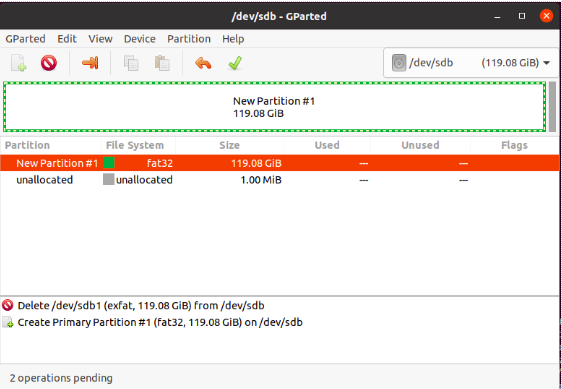


3. Click on tick mark for apply all operation → Apply


### 3.2 Flashing Ubuntu 24.04 on the SD card 
1. Download the ubuntu image from the following link, 

    https://amatama-my.sharepoint.com/:f:/g/personal/yuichi_horiuchi_amatama_onmicrosoft_com/ElrlDdJrIFBJsiOFYSBqh-4B9v1bY4-kuGneQeIGQxSdCw?e=7mWfvf 

2. Flash the ubuntu image into SD Card from the following link using Balena etcher or using Ubuntu writer as shown below : 

    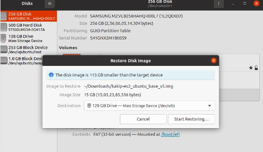


### 3.3 Update the Linux Kernel

Steps for setting up, applying patches, running the application, and building it 

#### 3.3.1. Build Environment (Same for application building) 

Create a container image of the AI SDK for RZ/V2H refering [Renesas procedure](https://renesas-rz.github.io/rzv_ai_sdk/5.00/getting_started.html).

Follow the below steps for creating container image:

##### 3.3.1.a Pre-requistes

1. Install Docker 

##### 3..3.1.b Setting up build environment for Kakip Kernel Development
1. Download AI SDK from the [link](https://www.renesas.com/document/sws/rzv2h-ai-sdk-v500)
     Extract RZ/V AI SDK package
2. On your Linux PC, make the working directory.
```bash
mkdir -p ai_sdk_work
```
3. Register the working directory path to an environment variable.
```bash
export WORK=<path to the working directory>/ai_sdk_work
```
4. Move to the working directory.
```bash
cd ${WORK}
```
5. Extract RZ/V AI SDK zip file under the working directory.
```bash
unzip <Path to the file>/RTK0EF0*.zip -d ${WORK}
```
6. Check the working directory to confirm the package contents.
```bash
ls ${WORK}/
```
- If the above command prints followings, the package is extracted correctly.
    ```bash
    ai_sdk_setup  board_setup  documents  references r11an0*.pdf
    ```
7. On your Linux PC, move to the working directory.
```bash
cd ${WORK}/ai_sdk_setup
```

8. Docker build
```bash
docker build -t rzv2h_ai_sdk_image --build-arg SDK="/opt/poky/3.1.31" --build-arg PRODUCT="V2H" .
```

9. Create new directory to be mounted on Docker container.
```bash
mkdir ${WORK}/ai_sdk_setup/data
```

10. Create docker container
```bash
sudo docker run --name kakip_env -it -v $PWD:/kakip_linux -w /kakip_linux rzv2h_ai_sdk_image
```


#### 3.3.2 Build Instructions


1. Cloning a Repository

```bash
#in new terminal list docker
sudo docker ps -a
```
start docker
```bash
sudo docker start -i kakip_env
```
If using for first time, nano may not be installed in docker, so install nano first to edit the files: 

```bash
apt update
apt install nano
```

Clone the git repository 
```bash
cd home
git clone https://github.com/Kakip-ai/kakip_linux
cd kakip_linux
```

2. Configuring the Kernel Config
```bash
cp ./arch/arm64/configs/kakip.config .config
```


3. Setting Environment Variables and Installing Dependencies

```bash
source /opt/poky/3.1.31/environment-setup-aarch64-poky-linux
apt update && apt install -y flex bison bc
```

4. Edit the dts file from the following path 

```bash
cd arch/arm64/boot/dts/renesas
#for pin address

nano kakip-es1.dts #edit in this file
```

In line number 231 & 232, do the following edits 

```
#for address mapping copy the first .dtsi and paste it in the terminal with nano.
#sci4_pins: sci4 {
#        pinmux = <RZG2L_PORT_PINMUX(7, 2, 1)>, /* SCI4_TXD_MOSI_SDA */
#                 <RZG2L_PORT_PINMUX(7, 3, 1)>; /* SCI4_RXD_MISO_SCL */
#};
```

```
source /opt/poky/3.1.31/environment-setup-aarch64-poky-linux
apt update && apt install -y flex bison bc
```

```
# #for pin mapping and functionalities
# nano r9a09g057.dtsi

# # okay for i2c7 
```


5. Build

Go back to kakip_linux folder
```bash
make -j4 Image
make -j4 renesas/kakip-es1.dtb
```

The build artifacts are the following two points.
```bash
./arch/arm64/boot/Image
./arch/arm64/boot/dts/renesas/kakip-es1.dtb
```

After building, exit from the container with exit.

```bash
exit
```

Copy the files into the sd card mounted with ubuntu images

1. First will delete the existing image: 

```bash
cd <folder_path> 

sudo rm -rf  kakip-es1.dtb Image-5.10.145-cip17-yocto-standard 
```


2. Copy the files  

```bash
sudo docker cp kakip_env:/root/kakip_linux/arch/arm64/boot/dts/renesas/kakip-es1.dtb /media/irinj/root/boot/
```

```bash
sudo docker cp kakip_env:/kakip_linux/kakip_linux/arch/arm64/boot/dts/renesas/r9a09g057.dtsi /media/irinj/root/boot
```


#### 3.3.4. For the first bootup of Kakip via serial/ssh  

1. Connect the ethernet 

2. Boot up the Kakip. 

3. Open gtkterm using 

    ```bash
    sudo gtkterm 
    ``` 

4. In the configuration -> port, select the serial port and set the baud rate (debugger) into 115200 

5. Login using the user ID(ubuntu) and password 

 6. Check for the ip address using the command in the serial terminal -  

    ```bash
    ifconfig  
    ```

7. Open new terminal and ssh into the board using the following command 

```bash
ssh ubuntu@<ip_address>  
```
 

8. Change locale:
    Change the locale in the following path:
    ```bash
        nano /etc/default/locale

        #in the opening window
        LANG=en_US.UTF-8
        LANGUAGE=en_US:en
    ```
    
    ```bash
    sudo dpkg-reconfigure locales
    #press enter twice and 97 followed by 3.

    #close it and 
    reboot now
    ```


 
## 4. Porting Hand gesture recognition on Kakip Board  

This application showcases the capability of deep neural networks to predict different hand gestures. It detects total of 8 Gestures that includes one, two, three, four, five, thumbs up, thumbs down and rock in the hand with the highest precision.  
1. [Porting the application by setting up Docker](#docker-environment-for-compiling-the-application)
2. [Verifying the application using the existing binary files](#generating-the-binary-file)

 

### 4.1 Docker environment for compiling the application  

#### Step 1: Clone the Repository in Linux PC 

After setting up the docker, go to the working repository and clone the repositories below in the docker 

```bash
cd /home/kakip_linux  

export WORK=/home/kakip_linux/ 

cd ${WORK} 

git clone https://github.com/Ignitarium-Renesas/rzv_ai_apps.git 
```

#### Step 2: Copy the A55 GPIO code and patch file into the working directory 

Download and unzip the folder AINEX_Patch provide from the folder Source code and copy into the working repository 

```bash
cd /home/kakip_linux 

mv hand_gesture.patch rzv_ai_apps/ 
``` 

#### Step 3: Apply the Patch File for making it portable for Kakip

To apply the patch file, follow the below command: 

1. Navigate into the working repository 

```bash 
cd ${PROJECT_PATH}/rzv_ai_apps/11_Head_count_topview/ 
```

2. Apply patch 

```bash
git apply ../../Kakip_RZV2H_Demos/Head_count_topview/Head_count_topview.patch 
```

#### Step 4: Navigate to the Application Directory 

Move to the source code directory of the application: 
```bash 
cd ${WORK}/rzv_ai_apps/12_Hand_gesture_recognition_v2/src 
```
 
#### Step 5: Build the Application 

Build the application by following the commands below. 

```bash
mkdir -p build && cd build 

cmake -DCMAKE_TOOLCHAIN_FILE=./toolchain/runtime.cmake -DV2H=ON .. 

make -j$(nproc) 
```

#### Step 6: Locate the Generated Application 

The built application file will be available in the following directory: 

```bash
${PROJECT_PATH}/12_Hand_gesture_recognition_v2/src/build 
```

The generated file will be named: 

```bash
hand_gesture_recognition_v2_app 
```

#### Step 7: Application: Deploy Stage 

Follow the steps below to deploy the project on board.  

Run the commands below to download the 12_Hand_gesture_recognition_v2_deploy_tvm-v230.so from Release v5.00 

```bash
cd ${PROJECT_PATH}/12_Hand_gesture_recognition_v2/exe_v2h/hand_yolov3_onnx 
```

```bash
wget https://github.com/Ignitarium-Renesas/rzv_ai_apps/releases/download/v5.00/12_Hand_gesture_recognition_v2_deploy_tvm-v230.so 
```

Rename the 12_Hand_gesture_recognition_v2_deploy_tvm-v230.so to deploy.so. 

```bash
mv 12_Hand_gesture_recognition_v2_deploy_tvm-v230.so deploy.so 
```

Follow the steps in session [Running the application](#running-the-application) 

### 4.2 Generating the binary file 

#### Step 1 : Copy the existing binary file

Follow the below commands to copy the existing binary file to renesas application

Navigate in to the below path before copying the executable:
```bash
rzv_ai_apps/12_Hand_gesture_recognition_v2/src 
```

```bash
sudo cp -r ../../Kakip_RZV2H_Demos/Hand_gesture/hand_gesture_recognition_v2_app exe_v2h 

cd .. 

scp -r 12_Hand_gesture_recognition_vz ubuntu@192.168.38.<ip>:/home/ubuntu 
```  

Once copied the required files into the board using scp, ssh into the board, and in the terminal there, give the following comments 

#### Step 2: Application: Deploy Stage 

Follow the steps in [Application: Deploy Stage ](#step-8-application-deploy-stage) to deploy the project on board.  


### 4.3 Running the application

Alternately for running the code instead of session 4.2, unzip the source code, provided in the folder Hand_gesture and copy it into Kakip using the below commands: 

In your Linux PC: 

```bash
unzip Hand_gesture.zip  

sudo scp -rf Hand_gesture ubuntu@<ip>:/home/ubuntu/ 
```

#### 4.3.1 Prerequisite to run the application in Kakip 

Follow the below commands before running the application in kakip 

```bash
ssh ubuntu@<IP> 

sudo apt update  

sudo apt install libpcre3  

sudo ldconfig  

ldconfig -p | grep libpcre  

sudo ln -s /usr/lib/aarch64-linux-gnu/libpcre.so.3 /usr/lib/aarch64-linux-gnu/libpcre.so.1 
```

#### 4.3.2. Executing the application 

Follow the commands below for running the application. 

##### Step 1: Navigate into the working repository 

Use cd to get into the working repository  

##### Step 2: Run the motor control code for Humanoid Robot 

```bash
cd Hand_gesture/A55_GPIO 

python3 socket_control.py 
```

##### Step 3: Run Hand gesture demo code 

```bash
cd Hand_gesture/Hand_Gesture_Recognition/exe_v2h 
./hand_gesture USB 
```

#### Output Frame:

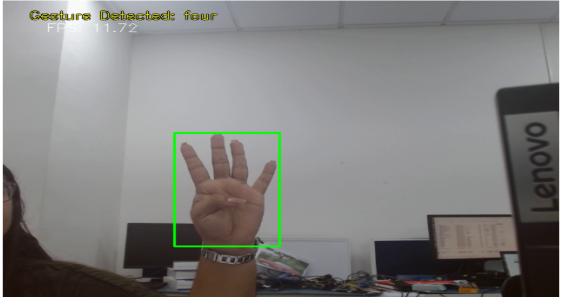

For more detailed instruction check :
https://ignitariumtech-my.sharepoint.com/:w:/g/personal/irine_jose_ignitarium_com/ESTSA92R3VlCmNKUS4DS6MIBm5TY0YBs382Q5Jsnw7rOPw?e=DHeoMG
  

## Reference 

Kakip Hardware: https://www.kakip.ai/wp-content/uploads/2024/04/Kakip_HW_Ref.pdf 

https://yds-kakip-team.github.io/techdoc/jp/ 

 